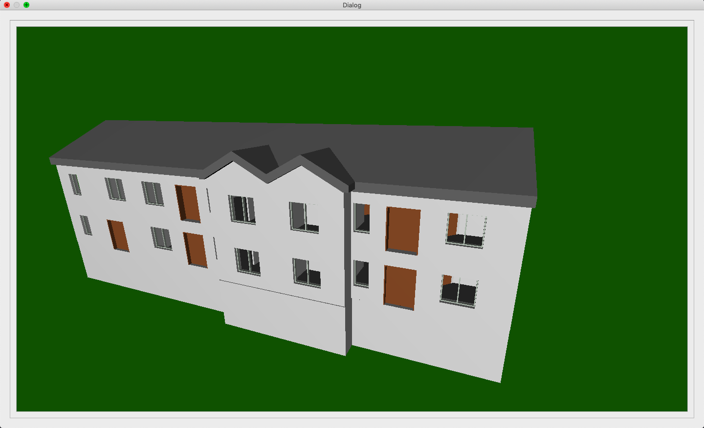

# QtGL 3D Building Info Model

**A minimal Qt + OpenGL app that loads and renders a 3D building from a binary BIM model—proof that you can embed real-time 3D inside an ordinary dialog.**

---

## What This Project Does

This is a **small, focused demo** that:

- Opens a **Qt dialog** with a scrollable area.
- Uses that area’s **viewport as a full OpenGL 4.1 Core canvas**.
- Loads a **binary building model** (`BIMhouse.model`) from Qt resources.
- Renders a **3D building** (geometry, normals, materials) with a **continuously rotating** dummy origin so the scene is in motion.
- Uses a **simple 3D scene graph** (scene, shapes, transformations) and **GLSL shaders** for rendering.

So in one window you get: **Qt UI + OpenGL 3D + custom BIM-style binary format**—all in a single executable.

---

## Why It Matters: The Problem It Solves

- **BIM-style visualization without a heavy stack**  
  You don’t need a full BIM suite to show a 3D building. This project shows how to **load a custom binary mesh format** (vertices, normals, indices, per-mesh color) and render it in a **normal Qt application**.

- **“Where do I put my 3D view?”**  
  A common need: a 3D view inside a dialog or tab, next to buttons and lists. Here, the **OpenGL view is the viewport of a `QAbstractScrollArea`**, so the 3D canvas lives exactly where you’d expect in a Qt UI.

- **Clear separation of concerns**  
  The **GraphicsCommon** layer (scene, shapes, transformations, program manager) keeps 3D logic out of the UI. The dialog and scroller only host the widget; the widget owns the scene and the BIM setup.

So the project is a **minimal, readable template** for: *Qt + OpenGL + custom 3D model loading + scene graph*, aimed at building-style visualization.

---

## How OpenGL Is Wired In (Qt Side)

OpenGL is **embedded** in a standard Qt widget so it behaves like any other control.

1. **Requesting an OpenGL context**  
   In `main.cpp`, a `QSurfaceFormat` is set to **OpenGL Core Profile 4.1** and applied as the default. Every window/surface that uses this default gets a proper Core GL context.

2. **The 3D view is a `QOpenGLWidget`**  
   `OpenGLWidget` inherits from **`QOpenGLWidget`** and **`QOpenGLFunctions`**. That gives you:
   - A **widget you can put in layouts** (here, used as the viewport of a `Scroller`).
   - Overrides: **`initializeGL()`**, **`resizeGL()`**, **`paintGL()`** for lifecycle and drawing.
   - **`initializeOpenGLFunctions()`** so Qt’s OpenGL wrappers are ready for GL 4.1 calls.

3. **Where the widget lives**  
   A **`Scroller`** (subclass of `QAbstractScrollArea`) uses **`setViewport(new OpenGLWidget())`**, so the **scroll area’s viewport is the OpenGL widget**. The dialog (from `scrolldialog.ui`) contains this scroller. So: **Dialog → Scroller → viewport = OpenGL widget**.

4. **Rendering loop**  
   In `paintGL()`, the widget updates a rotation, calls **`m_Scene->Render()`**, then **`update()`** to request the next frame. Qt’s event loop drives the repaints, so you get a continuous animation without a separate thread or timer.

5. **Actual GL usage**  
   - **Depth test** is enabled in `initializeGL()`.
   - The **GraphicsCommon** code uses **VAOs, VBOs, and a shader program manager**.
   - The scene sets **projection and view** (perspective + look-at) and each item uses **model** matrices; the **BIM nodes** draw the building geometry from the loaded binary data.

So: **OpenGL is “embedded” by making the 3D view a `QOpenGLWidget` and using it as the viewport of a scroll area inside a Qt dialog.** No separate window or platform-specific hacks—just widgets and layouts.

---

## Why Qt Fits This So Well

- **One framework for UI and windowing**  
  The same app can run on Windows, macOS, and Linux. The dialog, layout, and scroll area are all Qt; the OpenGL widget is just another widget.

- **`QOpenGLWidget`**  
  You get a **real OpenGL context** (here, Core 4.1) that’s correctly created and bound when the widget is shown and when it’s repainted. No need to fight the platform’s window system yourself.

- **Resources and deployment**  
  The binary model is shipped via **Qt resources** (`modelqrc.qrc` → `:/BinaryModel/BIMhouse.model`). No path hacks; the same code works from the build directory and from an installed app.

- **Clean integration**  
  The UI is designed in **Qt Designer** (`scrolldialog.ui`); the **custom `Scroller`** is promoted so the OpenGL widget is the viewport. What you see in the designer is what you get at runtime, with 3D inside it.

So the project is a good example of **Qt making it straightforward to put a serious OpenGL 4.1 viewer inside a normal, cross-platform GUI**.

---

## Project Layout (High Level)

| Part | Role |
|------|------|
| **`main.cpp`** | Sets default `QSurfaceFormat` (OpenGL 4.1 Core), creates and shows `ScrollDialog`. |
| **`ScrollDialog`** | Qt dialog (from `.ui`) that holds the `Scroller`. |
| **`Scroller`** | `QAbstractScrollArea` whose **viewport** is an **`OpenGLWidget`**. |
| **`OpenGLWidget`** | `QOpenGLWidget` / `QOpenGLFunctions`: `initializeGL`, `resizeGL`, `paintGL`; owns **`Gfx3DScene`** and **BIM** setup. |
| **`GraphicsCommon/`** | Scene graph and rendering: **`Gfx3DScene`**, **`Gfx3DTransformation`**, **`Gfx3DRenderableItem`**, **`Gfx3DShape`** (and subclasses like **`Gfx3DRectangle`**, **`Gfx3DBimNode`**), **`Gfx3DProgramManager`**. |
| **`BIMhouse.model`** | Binary mesh (vertices, normals, indices, materials) loaded from Qt resources and rendered as **`Gfx3DBimNode`**s. |

---

## Build and Run

- **Requirements:** Qt 5 (or Qt 6) with **Widgets** and **OpenGL** support; C++11.
- **Build:** Open **`QtGL3DBuildingInfoModel.pro`** in Qt Creator (or run `qmake` then your platform’s make).
- **Run:** Launch the app; the dialog opens with the 3D building rotating in the OpenGL viewport.

---

## Summary

- **What it does:** Renders a 3D building from a binary BIM-style model inside a Qt dialog, with a scroll area and continuous rotation.
- **How OpenGL is embedded:** The 3D view is a **`QOpenGLWidget`** used as the **viewport** of a **`QAbstractScrollArea`**; OpenGL 4.1 Core is requested in **`main.cpp`** and used for the whole scene.
- **What problem it solves:** Shows a minimal, readable way to do **Qt + OpenGL + custom binary 3D model + scene graph** for building-style visualization, without a heavy engine or framework.

The image at the top (**`output.png`**) is what you see when you run it: the same 3D building in the same Qt dialog.
